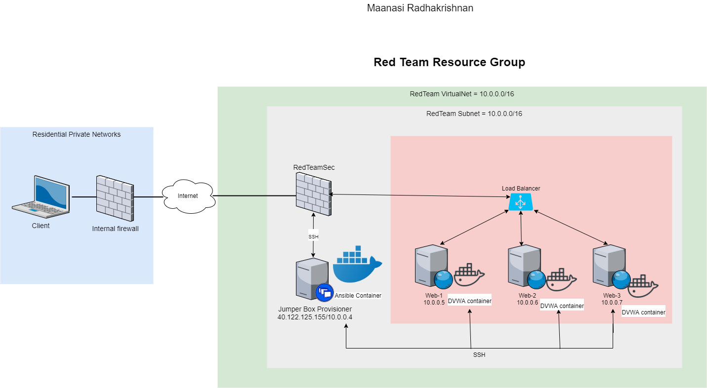

## Automated ELK Stack Deployment

The files in this repository were used to configure the network depicted below.

These files have been tested and used to generate a live ELK deployment on Azure. They can be used to either recreate the entire deployment pictured above. Alternatively, select portions of the _____ file may be used to install only certain pieces of it, such as Filebeat.

  - _TODO: Enter the playbook file._

This document contains the following details:
- Description of the Topology
- Access Policies
- ELK Configuration
  - Beats in Use
  - Machines Being Monitored
- How to Use the Ansible Build

### Description of the Topology

The main purpose of this network is to expose a load-balanced and monitored instance of DVWA, the D*mn Vulnerable Web Application.
Load balancing ensures that the application will be highly availability_, in addition to restricting inbound access to the network.
- _TODO: What aspect of security do load balancers protect? What is the advantage of a jump box?
Load balancers protects the system from DDoS attacks by shifting attack traffic. The advantage of a jump box is to give access to the user from a single node that can be secured and monitored.

Integrating an ELK server allows users to easily monitor the vulnerable VMs for changes to the _____ and system _____.
- _TODO: What does Filebeat watch for?_
- _TODO: What does Metricbeat record?_

The configuration details of each machine may be found below.
_Note: Use the [Markdown Table Generator](http://www.tablesgenerator.com/markdown_tables) to add/remove values from the table_.

| Name     | Function  | IP Address | Operating System |
|----------|-----------|------------|------------------|
| Jump Box | Gateway   | 10.0.0.4   | Linux            |
| Web-1    | Web Server| 10.0.0.5   | Linux            |
| Web-2    | Web Server| 10.0.0.6   | Linux            |
| Web-3    | Web Server| 10.0.0.7   | Linux            |

### Access Policies

The machines on the internal network are not exposed to the public Internet. 

Only the _____ machine can accept connections from the Internet. Access to this machine is only allowed from the following IP addresses:
- _TODO: Add whitelisted IP addresses_
47.187.22x.xx (security reason removed)

Machines within the network can only be accessed by _____.
- _TODO: Which machine did you allow to access your ELK VM? What was its IP address?_

A summary of the access policies in place can be found in the table below.

| Name     | Publicly Accessible | Allowed IP Addresses |
|----------|---------------------|----------------------|
| Jump Box | Yes                 |   [Remote IP address]|
| Web-1    | No                  | 10.0.0.4             |
| Web-2    | No                  | 10.0.0.4             |
| Web-3    | No                  | 10.0.0.4             |
