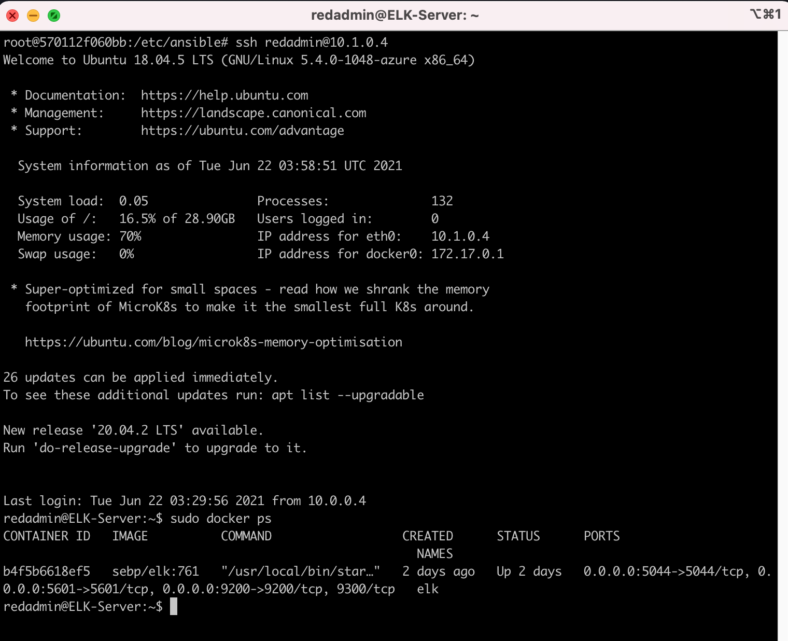

## Automated ELK Stack Deployment

The files in this repository were used to configure the network depicted below.

These files have been tested and used to generate a live ELK deployment on Azure. They can be used to either recreate the entire deployment pictured above. Alternatively, select portions of the filebeat-playbook.yml file may be used to install only certain pieces of it, such as Filebeat.

  - install-elk.yml

This document contains the following details:
- Description of the Topology
- Access Policies
- ELK Configuration
  - Beats in Use
  - Machines Being Monitored
- How to Use the Ansible Build

### Description of the Topology

The main purpose of this network is to expose a load-balanced and monitored instance of DVWA, the D*mn Vulnerable Web Application.
Load balancing ensures that the application will be highly availability, in addition to restricting inbound access to the network.
- What aspect of security do load balancers protect? What is the advantage of a jump box?
Load balancers protects the system from DDoS attacks by shifting attack traffic. The advantage of a jump box is to give access to the user from a single node that can be secured and monitored.

Integrating an ELK server allows users to easily monitor the vulnerable VMs for changes to the logs and system traffic .
- What does Filebeat watch for?
Filebeat monitors locations and log files, collects log event data, and sends that data to Elasticsearch or Logstash.
- What does Metricbeat record?
Metricbeat documents the statistics and metrics that it collects, and sends them to an output such as Logstash or ElasticSearch.

The configuration details of each machine may be found below.
_Note: Use the [Markdown Table Generator](http://www.tablesgenerator.com/markdown_tables) to add/remove values from the table_.

| Name       | Function  | IP Address | Operating System |
|------------|-----------|------------|------------------|
| Jumper-Box | Gateway   | 10.0.0.4   | Linux            |
| Web-1      | Web Server| 10.0.0.5   | Linux            |
| Web-2      | Web Server| 10.0.0.6   | Linux            |
| Web-3      | Web Server| 10.0.0.7   | Linux            |
| ELK        | ELK-Server| 10.1.0.4   | Linux            |

### Access Policies

The machines on the internal network are not exposed to the public Internet. 

Only the Jumper-Box machine can accept connections from the Internet. Access to this machine is only allowed from the following IP addresses:
- 47.187.22x.xx (security reason removed)

Machines within the network can only be accessed by _____.
- 10.0.0.4 (JumperBox)

A summary of the access policies in place can be found in the table below.

| Name     | Publicly Accessible | Allowed IP Addresses |
|----------|---------------------|----------------------|
| Jump Box | Yes                 | 47.187.22x.xx        |
| Web-1    | No                  | 10.0.0.1-254         |
| Web-2    | No                  | 10.0.0.1-254         |
| Web-3    | No                  | 10.0.0.1-254         |
| ELK      | YES                 | 47.187.22x.xx        |

### Elk Configuration

Ansible was used to automate configuration of the ELK machine. No configuration was performed manually, which is advantageous because...
- What is the main advantage of automating configuration with Ansible?_
The advantage is that the same configuration can be automated and deployed to multiple machines, as opposed to manually deploying the configuration to each and every machine in an isolated manner. The full effect of this can be felt in network topology with a large number of machines as it drastically shortens the time to deploy to a large number of machines and have a positive impact for businesses.

The playbook implements the following tasks:
-Use apt module to install docker.io
-Use apt module to install python3-pip
-Use pip module to install docker python library module
-Run "$ sysctl -w vm.max_map_count=262144" in a shell to increase virtual memory
-Use sysctl module to then increase memory usage
-Use the Docker_container module to download and launch the "sebp/elk:761" ELK container and -ensure it always starts when the system starts up and publish ports; 5601, 9200, 5044.
-Use systemd module to ensure docker.io service is always running on boot up

The following screenshot displays the result of running `docker ps` after successfully configuring the ELK instance.

### Target Machines & Beats
This ELK server is configured to monitor the following machines:
- 
Web-1: 10.0.0.5
Web-2: 10.0.0.6
Web-3: 10.0.0.7

We have installed the following Beats on these machines:
-
Web-1: 10.0.0.5
Web-2: 10.0.0.6
Web-3: 10.0.0.7

These Beats allow us to collect the following information from each machine:

Filebeat monitors the log files or locations that you specify, collects log events, where as Metricbeat documents the statistics and metrics that it collects, 

Here the filebeat captured the web server(HTTP) logs the system logs from both web-1, web-2 and web-3.

### Using the Playbook
In order to use the playbook, you will need to have an Ansible control node already configured. Assuming you have such a control node provisioned: 

SSH into the control node and follow the steps below:
- Copy the elk.yml file to /etc/ansible.
- Update the /etc/ansible/hosts file with your new group and include the IP address of the ELK VM
Update the /etc/ansible/ansible.cfg file with the login name and IP address of the ELK VM
- Run the playbook, and navigate to  http://[ELK-PUBLIC-IP]:5601/app/kibana# to check that the installation worked as expected.

Answer the following questions to fill in the blanks:
- Which file is the playbook? Where do you copy it?
The playbook to install kibana is install-elk.yml.

- Which file do you update to make Ansible run the playbook on a specific machine? How do I specify which machine to install the ELK server on versus which to install Filebeat on?_
- Which URL do you navigate to in order to check that the ELK server is running?

http://[ELK-PUBLIC-IP]:5601/app/kibana# 

_As a **Bonus**, provide the specific commands the user will need to run to download the playbook, update the files, etc._

--
- $ ssh redadmin@PublicIPofJumpBox 
- $ cd /etc/ansible
- $ nano /etc/ansible/hosts #update the group and IP address of ELK VM
- $ nano /etc/ansible/ansible.cfg #update the login name and IP address of the ELK VM
- $ nano install-elk.yml 
    - Paste text from install-elk.yml
- $ sudo ansible-playbook install-elk.yml
- $ sudo ansible-playbook filebeat-playbook.yml
